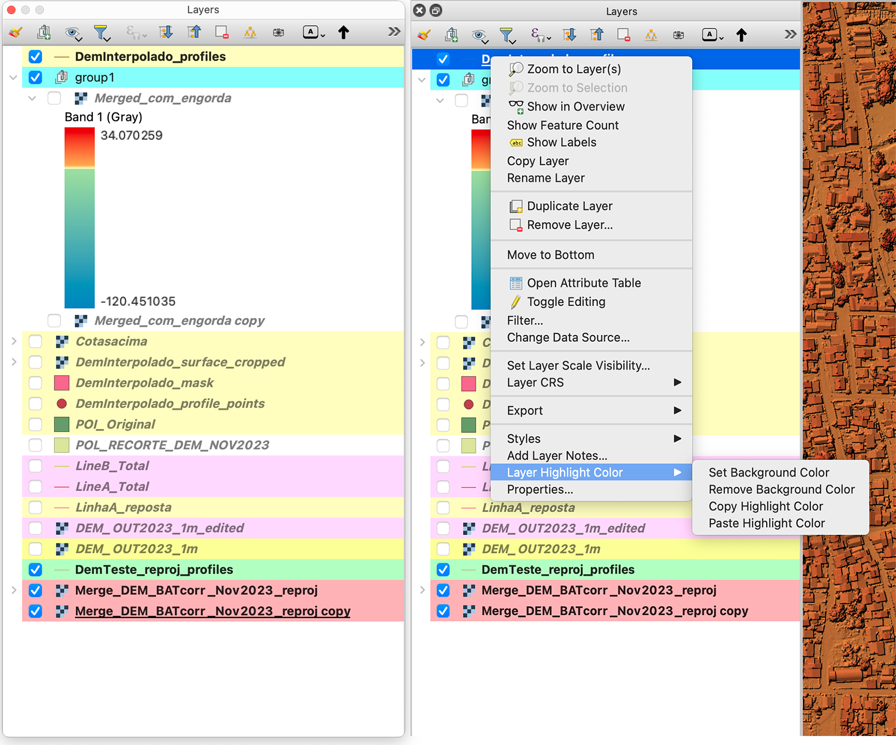

# Layer Color Plugin

This is a QGIS plugin that enables users to customize the background colors of layers and groups in the layer tree view, enhancing visual organization and project management. This plugin streamlines the organization and management of complex QGIS projects by allowing users to visually distinguish different layers through custom background colors. 

**Tip:** Always choose pastel or lighter colors. The code implements WCAG 2.0 contrast ratio checking to avoid colors that can make it hard to read the layer text. 

## Purpose
This plugin streamlines the organization and management of complex QGIS projects by allowing users to visually distinguish different layers through custom background colors.

## Usage
This plugin installs a menu in the layer options menu, called “Layer Highlight Color”, that can be used as follows:

- Right-click on any layer or group in the layer panel
- Navigate to “Layer Highlight Color” submenu
- Choose from available options:
  - Set Background Color
  - Copy Highlight Color
  - Paste Highlight Color
  - Remove Background Color

## Time-Saving Tips
### Batch Operations
- Select multiple layers of the same type
- Copy color from one reference layer for color consistency among several layers
- Paste to all selected layers simultaneously
- Create consistent color schemes across project sections

### Project Organization
- Use color intensity to show data hierarchy
- Apply similar colors to related data groups
- Create visual separation between different data themes
- Maintain consistent color coding across project updates

This visual organization system significantly reduces the time needed to locate and manage layers in projects with hundreds of datasets.

## Usage Examples
### Geological Mapping Project
- Color all geological unit layers in shades of brown
- Highlight active fault lines in bright red
- Mark geophysical survey areas in purple
- Group and color all borehole data in blue shades
- Distinguish different geological ages with color intensity variations

### Urban Planning Project
- Mark zoning layers in distinct pastel colors
- Highlight protected areas in green tones
- Color infrastructure layers in grayscale
- Group and color all transportation layers in warm colors
- Distinguish development phases with different color intensities

### Environmental Impact Study
- Color sensitive habitat areas in green
- Mark pollution monitoring points in red
- Highlight water bodies in blue shades
- Group and color all sampling locations in yellow
- Distinguish impact zones with gradient colors

### Archaeological Site Management
- Color different excavation periods in distinct hues
- Highlight artifact concentration areas in warm colors
- Mark survey grids in cool colors
- Group and color all dating samples in purple
- Distinguish conservation zones with specific color codes

## Features
### Color Management
- Set custom background colors for layers and groups in the layer panel
- Copy and paste colors between different layers
- Remove background colors from selected layers

### User Interface
- Adds a “Layer Highlight Color” submenu to the layer context menu
- Provides color selection through a standard color dialog
- Maintains color persistence across project saves and loads

### Accessibility
- Implements WCAG 2.0 contrast ratio checking
- Warns users when selected colors might make text difficult to read
- Calculates contrast ratios against black text using WCAG AA standards (4.5:1 ratio)

## Technical Details
### Color Handling
- Colors are stored in both memory and project files
- Uses custom properties to save color information with each layer
- Automatically updates the layer tree view when colors change

### Project Integration
- Automatically saves colors when the project is saved
- Restores color settings when projects are loaded
- Maintains color consistency across QGIS sessions

___Renato Henriques - University of Minho/Institute of Earth Sciences___
